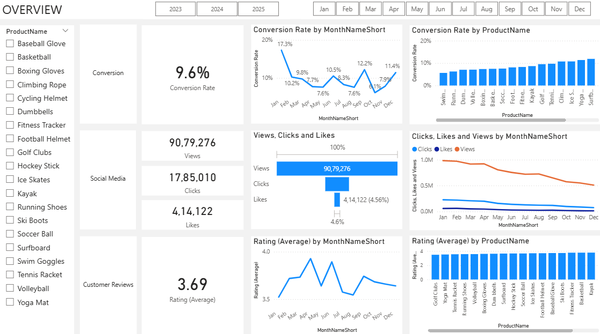
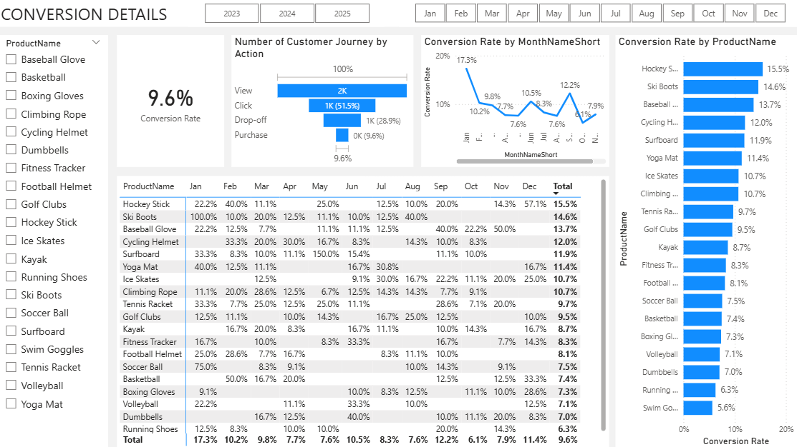
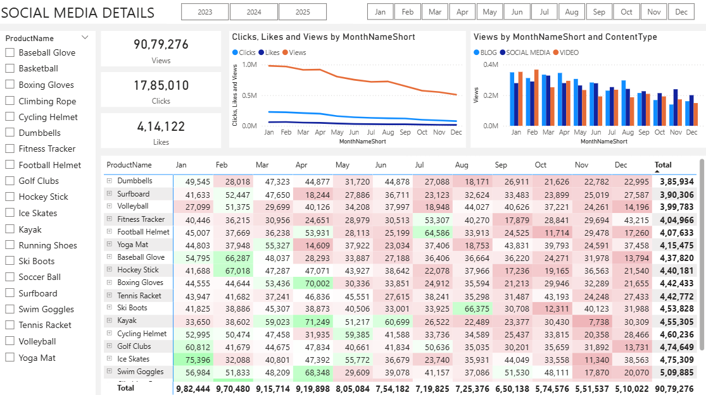
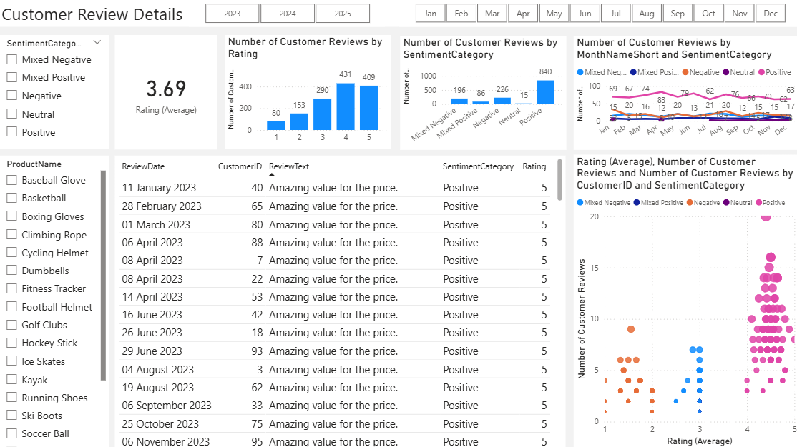

# Marketing Strategy & Performance Analysis

This project presents an end-to-end analysis of a company's marketing performance, focusing on conversion rates, social media engagement, and customer feedback. The analysis leverages SQL for data cleaning, Python for sentiment analysis, and Power BI for creating interactive dashboards. The final output provides a clear overview of key performance indicators and delivers actionable recommendations to drive business growth.

---

## Table of Contents
* [Overview](#overview)
* [Business Problem](#business-problem)
* [Dataset](#dataset)
* [Tools & Technologies](#tools--technologies)
* [Project Structure](#project-structure)
* [Data Cleaning & Preparation](#data-cleaning--preparation)
* [Exploratory Data Analysis (EDA)](#exploratory-data-analysis-eda)
* [Research Questions & Key Findings](#research-questions--key-findings)
* [Dashboard](#dashboard)
* [How to Run This Project](#how-to-run-this-project)
* [Final Recommendations](#final-recommendations)
* [Author & Contact](#author--contact)

---

## Overview

This project analyzes marketing data to identify key trends and performance metrics. The workflow begins with data extraction and cleaning in a SQL environment. Following this, a Python script is used to perform advanced sentiment analysis on customer reviews. Finally, all processed data is visualized in a comprehensive Power BI dashboard, which serves as the basis for deriving strategic business recommendations aimed at improving marketing effectiveness and customer satisfaction.

---

## Business Problem

The core business problems addressed in this analysis are:
1.  **Decreased Conversion Rates:** The company needs to understand the factors driving fluctuations in conversion rates and identify opportunities for optimization.
2.  **Reduced Customer Engagement:** There is a noticeable decline in social media engagement, requiring an analysis of content performance to inform a more effective strategy.
3.  **Below-Target Customer Feedback:** The average customer rating is below the target of 4.0, indicating a need to understand customer sentiment and address key areas of concern.

---

## Dataset

The analysis is based on a database backup (`.bak` file) containing several tables representing different facets of the business:
* **Customer Journey:** Contains data on customer interactions, stages (e.g., View, Click), and actions (e.g., Purchase).
* **Engagement Data:** Includes social media metrics like Views, Clicks, and Likes across different content types.
* **Customer Reviews:** Contains customer ratings and text feedback for various products.
* **Product Dimension:** A table with details about each product, including price and name.
* **Customer Dimension:** A table with customer demographics, enriched with geographical data.

---

## Tools & Technologies

* **Database:** SQL Server
* **Data Cleaning & Transformation:** SQL
* **Data Analysis & Feature Engineering:** Python (Pandas, NLTK, pyodbc)
* **Data Visualization:** Power BI

---

## Project Structure

marketing-performance-strategy-analysis\
```
├── database_backup/
│   └── MarketingAnalytics.bak
├── sql_scripts/
│   ├── dim_customer.sql
│   ├── dim_products.sql
│   ├── fact_customer_journey.sql
│   ├── fact_engagement_data.sql
│   └── customer_review.sql
├── python_scripts/
│   └── customer_reviews_enrichment.py
├── power_bi/
│   └── Marketing_Analysis_Dashboard.pbix
├── presentation/
│   └── Marketing_Analysis_Presentation.pptx
└── README.md
```
---

## Data Cleaning & Preparation

**1. SQL Transformations:**
* **Deduplication:** Removed duplicate records from the customer journey data using `ROW_NUMBER()` to ensure data integrity.
* **Data Standardization:** Standardized text fields (e.g., `UPPER(Stage)`) and split combined columns (e.g., `ViewsClicksCombined` into `Views` and `Clicks`).
* **Whitespace Cleaning:** Cleaned customer review text by removing extra spaces using nested `REPLACE` and `TRIM` functions.
* **Data Enrichment:** Enriched customer data by joining with a geography table and categorized products by price using a `CASE` statement.

**2. Python-based Sentiment Analysis:**
* The `customer_reviews_enrichment.py` script was used to perform sentiment analysis on customer review text.
* It utilizes the **NLTK VADER** library to calculate a sentiment score for each review.
* A custom function was developed to assign a `SentimentCategory` ('Positive', 'Negative', 'Mixed') by combining the numerical sentiment score with the star rating provided by the customer, creating a more nuanced and accurate classification.

---

## Exploratory Data Analysis (EDA)

EDA was conducted within Power BI to explore trends and patterns across three key areas:
1.  **Conversion Analysis:** Investigated how conversion rates change over time and across different products.
2.  **Engagement Analysis:** Analyzed trends in social media views, clicks, and likes, and compared the performance of different content types (Blog, Social Media, Video).
3.  **Customer Feedback Analysis:** Explored the distribution of customer ratings and the sentiment breakdown to understand customer satisfaction drivers.

---

## Research Questions & Key Findings

**1. How did conversion rates perform throughout the year?**
* The overall conversion rate was **8.5%**.
* [cite_start]Rates peaked in **January at 18.5%**, driven by a **150% conversion rate for Ski Boots**[cite: 19].
* [cite_start]The lowest conversion rate occurred in **May at 4.3%**[cite: 16].
* Top-performing products for the year were **Kayak (21.4%)**, **Ski Boots (20.0%)**, and **Surfboard (13.9%)**.

**2. What are the key trends in customer engagement?**
* [cite_start]Social media views peaked early in the year but showed a **steady decline from August onwards**[cite: 23].
* [cite_start]Although absolute clicks and likes are low, the **click-through rate (CTR) is a healthy 15.37%**, indicating that engaged users interact effectively[cite: 7].
* [cite_start]**Blog content drove the most views**, especially in April and July, outperforming other content types[cite: 27].

**3. What is the overall customer sentiment?**
* [cite_start]The average customer rating is **3.7**, which is stable but below the company's target of 4.0[cite: 9, 10].
* [cite_start]Feedback is predominantly positive, with **275 reviews classified as 'Positive'** and a majority of ratings being 4 or 5 stars[cite: 30, 33].
* [cite_start]There are **82 'Negative' reviews** and several 'Mixed' reviews, which represent opportunities for improvement[cite: 34, 36].

---

## Dashboard

1. Main Overview Dashboard
This dashboard serves as the central summary, providing a high-level snapshot of the most critical Key Performance Indicators (KPIs). It covers the three core areas of the analysis: overall conversion rate, social media engagement totals, and the average customer rating.


2. Conversion Details Dashboard
This dashboard offers a deep dive into the 9.6% conversion rate. It visualizes the customer journey funnel from view to purchase and provides a detailed breakdown of conversion rates by individual product and by month, allowing for the identification of top-performing products and seasonal trends.


3. Social Media Details Dashboard
This dashboard focuses entirely on social media performance. It tracks trends in Views, Clicks, and Likes over time and breaks down these metrics by content type (Blog, Social Media, Video) and by product. This view is crucial for understanding content effectiveness and audience engagement.


4. Customer Review Details Dashboard
This dashboard visualizes the results of the customer feedback and sentiment analysis. It shows the distribution of customer ratings, the breakdown of reviews by sentiment category (Positive, Negative, Mixed, etc.), and explores the relationship between star ratings, review volume, and sentiment.


---

# How to Run This Project

1.  **Clone Repository:**
    ```bash
    git clone https://github.com/pujitasunnapu/marketing-analysis.git
    ```

2.  **Database Setup (SSMS):**
    * Locate the `MarketingAnalytics.bak` file in the `/database_backup/` directory.
    * Open **SQL Server Management Studio (SSMS)** and connect to your database engine.
    * Right-click on the **Databases** folder in the Object Explorer and select **Restore Database...**.
    * In the Restore Database window, select **Device** as the source and click the `...` button to locate the `.bak` file on your local machine.
    * Click **OK** to close the file locator, and then click **OK** again to begin the restore process. The `MarketingAnalytics` database will now be available on your server.
    * *Note: The scripts in the `/sql_scripts/` folder represent the transformation and cleaning logic that was applied to the data in this database.*

3.  **Python Environment:**
    * Install the required Python libraries:
        ```bash
        pip install pandas pyodbc nltk
        ```
    * Run the NLTK downloader to get the 'vader_lexicon'.
    * Update the database connection string in `customer_reviews_enrichment.py` and run the script. This will generate the `fact_customer_reviews_with_sentiment.csv` file.

4.  **Power BI:**
    * Open the `Marketing_Analysis_Dashboard.pbix` file.
    * Refresh the data sources, connecting to your SQL Server database and the CSV file generated in the previous step.

---

## Final Recommendations

Based on the analysis, the following actions are recommended:

1.  [cite_start]**Increase Conversion Rates**[cite: 50]:
    * [cite_start]**Action:** Focus marketing efforts on top-performing product categories like **Kayaks, Ski Boots, and Surfboards**[cite: 51]. [cite_start]Implement **seasonal promotions** during peak months such as January to capitalize on high-intent periods[cite: 52].

2.  [cite_start]**Enhance Customer Engagement**[cite: 53]:
    * [cite_start]**Action:** **Revitalize the content strategy** to combat declining views by experimenting with more engaging formats like interactive videos or user-generated content[cite: 54]. [cite_start]**Optimize call-to-action (CTA) placement**, especially during the lower engagement months of September-December[cite: 55].

3.  [cite_start]**Improve Customer Feedback Scores**[cite: 56]:
    * [cite_start]**Action:** Implement a **structured feedback loop** to analyze mixed and negative reviews to identify common issues[cite: 57]. [cite_start]Develop action plans to address these concerns and follow up with dissatisfied customers to improve satisfaction and lift the average rating towards the 4.0 target[cite: 58].

---

## Author & Contact

**Pujita Sunnapu**

📧 Email: pujitasunnapu@gmail.com  
🔗 [GitHub](https://www.github.com/pujitasunnapu/)  
🔗 [LinkedIn](https://www.linkedin.com/in/pujitasunnapu/)

